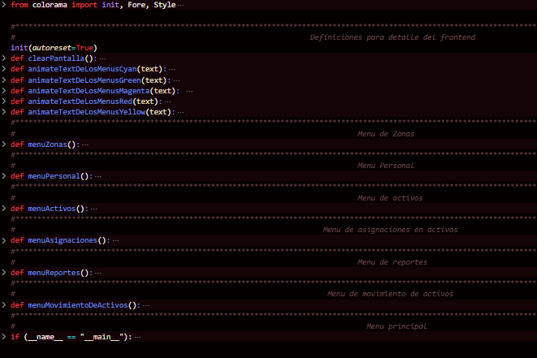
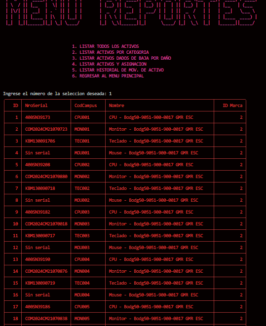
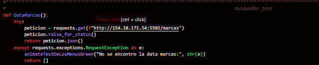
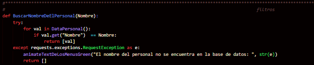
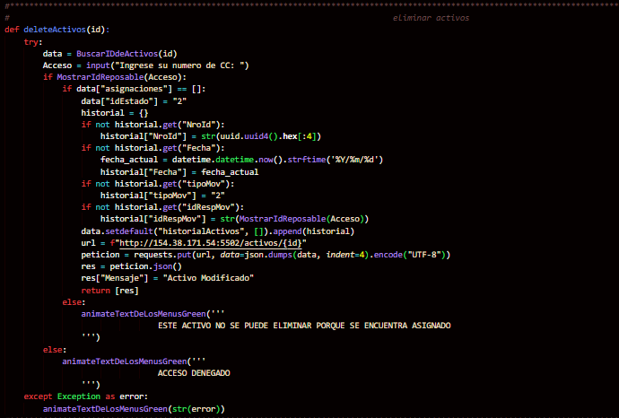
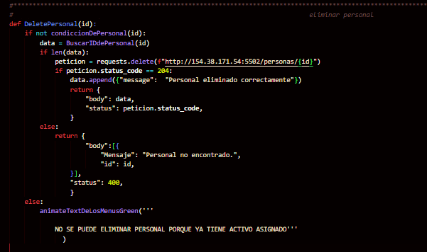
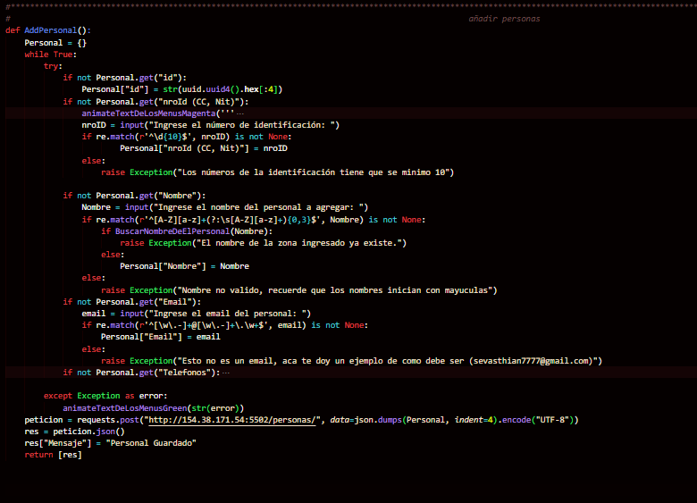
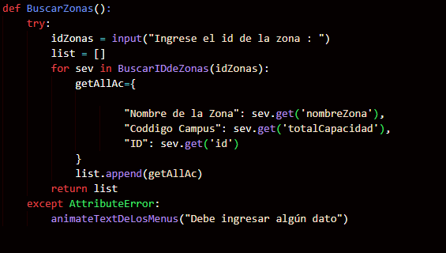
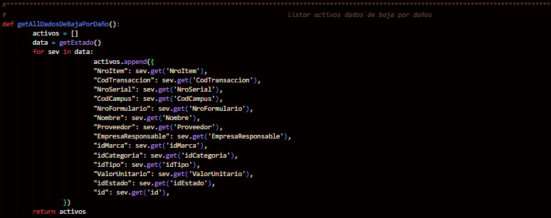

# SISTEMA G&C DE INVENTARIO CAMPUSLANDS
### ENQUE CONSISTE EL PROGRAMA

El programa permite llevar el control de todos los activos que se
encuentran en su sede principal ubicada en la ciudad de bucaramanga.

 

## COMO ESTA ORGANIZADO CADA ARCHIVO DE PYTHON

Como podemos ver la organizacion de los archivos python, todos tiene un titulo lo cual los hace especificar su rol en el codigo

## TIPO DE IMPORTACIONES QUE SE HICIERON EN LA MAIN

## ALGUNOS DISEÑOS QUE SE HICIERON A LO LARGO DEL PROGRAMA

Utilice este tipo de funcion para asignar colores de cada a cada menu y un respectivo movimiento
cada color tiene una funcion en especifico:

 

- La función "animateTextDeLosMenusCyan" se utilizo solamente para el menu principal
- La función "animateTextDeLosMenusGreen" para mostrarme los tipos de errores
- La función "animateTextDeLosMenusMagenta" se utilizo para tabla de resultado
- La función "animateTextDeLosMenusRed" se utilizo para los menus segundarios
- La función "animateTextDeLosMenusYellow" se utilizo para elemento que proporcionan información al usuario para tener una mejor
al manejar el programa facilidad del programa

Este tipo de función solo se utilizo para limpiar la patalla en cualquier tipo de sistema operativo

### COMO OPTIENE LOS RESULTADOS

 El diseño del programa es en modo tabla todos los datos va a ser mostrados organizados en modo tabla

## INTERFAS DEL PROGRAMA

Esta es la interfas del programa la cual se puede obsevar que tenemos diferentes opciones
cada una de estas opciones nos permite acceder a otro tipo de menus

 

### COMO ESTA CONSTRUIDO EL MENU

La varible opciones nos registra un codigo el cual va a ser evaluado por cada una de las condicones y 
me va a direccionar a los menus de dicha opcion y los except son posibles error que se registren en la varible opciones

 

## INTERFAS DE TODOS MENUS LOS MENUS
#### MENU DE ACTIVOS

#### MENU DE PERSONAL

#### MENU DE ZONAS

#### MENU DE ASIGNACIONES

#### MENU DE REPORTES

#### MENU DE MOVIMIENTOS

Como podemos notar en estas imagenes tiene la misma funcionalidad que la interfas
del programa, lo unico que tenemos que hacer es seleccionar una opcion

 

### COMO ESTA CONSTRUIDO LOS MENUS

Podemos obsevar que todos menus tiene la misma estructura

 

### ESTRUCTURA DE LAS FUNCIONES DE BUSQUEDA

Todas las funciones tiene esta misma estructura cada "def" me dice para que esta hecha ese tipo de busqueda

 

### ESTRUCTURA DE LOS FILTRO 

Los filtros son usados para validaciones en este programa

 

### ESTRUCTURA PARA ELIMINAR UN ACTIVO

Este código es una función en Python llamada `DeletePersonal` que toma un argumento `id`. Su objetivo es eliminar un registro de la base de datos.

Aquí está la explicación:

1. `def DeletePersonal(id):`: Esto define una función llamada `DeletePersonal` que toma un parámetro `id`.

2. `if not condiccionDePersonal(id):`: Aquí se verifica si la función `condiccionDePersonal(id)` devuelve `False`. Si la condición no se cumple, significa que el registro de personal con el ID proporcionado no existe o no cumple alguna condición necesaria para ser eliminado.

3. `data = BuscarIDdePersonal(id)`: Se busca el registro de personal con el ID proporcionado utilizando la función `BuscarIDdePersonal(id)` y se asigna el resultado a la variable `data`.

4. `if len(data):`: Se verifica si `data` contiene algún dato. Si es así, significa que se encontró un registro de personal con el ID proporcionado y se puede proceder con la eliminación.

5. `peticion = requests.delete(f"http://154.38.171.54:5502/personas/{id}")`: Se envía una solicitud de eliminación al servidor utilizando la biblioteca `requests`. La URL a la que se envía la solicitud incluye el ID del personal que se quiere eliminar.

6. `if peticion.status_code == 204:`: Se verifica si la solicitud de eliminación fue exitosa. El código de estado HTTP `204` indica que la solicitud se completó con éxito y que no hay contenido para devolver.

7. Si la eliminación fue exitosa, se agrega un mensaje indicando que el personal se eliminó correctamente al conjunto de datos `data`.

8. Se devuelve un diccionario que contiene el cuerpo de la respuesta (que incluye `data` y posiblemente un mensaje de error si no se encontró el personal), así como el código de estado de la solicitud HTTP.

9. Si no se encontró el personal o si hubo algún problema durante el proceso de eliminación, se devuelve un diccionario que contiene un mensaje de error y un código de estado HTTP `400`.

10. Si la condición en la línea 2 es `True`, significa que la función `condiccionDePersonal(id)` devuelve `True`, lo que indica que el personal no se puede eliminar porque ya tiene un activo asignado. En este caso, se llama a la función `animateTextDeLosMenusGreen` con un mensaje indicando que no se puede eliminar el personal debido a esta condición.

### ESTRUCTURA PARA ELIMINAR UN PERSONAL O UNA ZONA

Esta función en Python, llamada `deleteActivos`, eliminar un activo de la base de datos. 

Aquí está la explicación:

1. `def deleteActivos(id):`: Esto define una función llamada `deleteActivos` que toma un argumento `id`, que presumiblemente es el identificador único del activo que se desea eliminar.

2. `try:`: Comienza un bloque `try-except`, lo que significa que el código dentro del bloque `try` se ejecutará, y si ocurre algún error, se manejará dentro del bloque `except`.

3. `data = BuscarIDdeActivos(id)`: Busca el activo con el ID proporcionado utilizando la función `BuscarIDdeActivos(id)` y guarda la información en la variable `data`.

4. `Acceso = input("Ingrese su numero de CC: ")`: Solicita al usuario que ingrese su número de CC (presumiblemente de identificación) mediante la función `input()` y lo almacena en la variable `Acceso`.

5. `if MostrarIdReposable(Acceso):`: Verifica si el número de CC ingresado tiene acceso al sistema, utilizando la función `MostrarIdReposable(Acceso)`. Si este número tiene acceso, continúa con el proceso de eliminación.

6. `if data["asignaciones"] == []:`: Verifica si el activo no está asignado a ninguna persona, es decir, si la lista de asignaciones está vacía.

7. Si el activo no está asignado, se procede a modificar su estado y se registra un historial de esta acción. Se utiliza un diccionario llamado `historial` para almacenar detalles sobre la modificación del activo. Si algunos detalles no existen en el historial, se generan y agregan.

8. Se agrega el historial al diccionario `data`.

9. Se construye la URL a la que se enviará la solicitud PUT para actualizar el activo.

10. Se envía una solicitud PUT al servidor con la URL y los datos del activo en formato JSON. La solicitud PUT actualiza el recurso en el servidor con los nuevos datos proporcionados.

11. Se procesa la respuesta de la solicitud y se agrega un mensaje indicando que el activo ha sido modificado correctamente.

12. Si el activo está asignado a alguien (la lista de asignaciones no está vacía), se muestra un mensaje de que el activo no se puede eliminar porque está asignado.

13. Si el número de CC no tiene acceso al sistema, se muestra un mensaje de acceso denegado.

14. Si ocurre algún error durante el proceso, se captura y se muestra como un mensaje de error.
#### y la estructura de eliminar zona tiene el mismo proceso. 

 

### ESTRUCTURA PARA AGREGAR ACTIVOS, PERSONAL Y ZONAS

Esta función en Python, llamada `AddPersonal`, tiene como objetivo agregar un nuevo registro de personal en la base dedatos.

Aquí está la explicación:

1. `def AddPersonal():`: Define una función llamada `AddPersonal`.

2. `Personal = {}`: Crea un diccionario vacío llamado `Personal` para almacenar la información del nuevo personal.

3. `while True:`: Inicia un bucle `while` infinito, lo que significa que el código dentro de este bucle se ejecutará repetidamente hasta que se encuentre una instrucción de ruptura (`break`).

4. `try:`: Inicia un bloque `try-except`, lo que significa que el código dentro del bloque `try` se ejecutará y cualquier error que ocurra se manejará dentro del bloque `except`.

5. `if not Personal.get("id"): ...`: Verifica si el campo "id" no está presente en el diccionario `Personal`. Si no está presente, genera un identificador único utilizando `uuid.uuid4().hex[:4]` y lo asigna al campo "id".

6. `if not Personal.get("nroId (CC, Nit)"): ...`: Verifica si el campo "nroId (CC, Nit)" no está presente en el diccionario `Personal`. Si no está presente, solicita al usuario ingresar el número de identificación (presumiblemente el documento de identificación) y lo asigna al campo. Se valida que el número ingresado tenga al menos 10 dígitos.

7. `if not Personal.get("Nombre"): ...`: Verifica si el campo "Nombre" no está presente en el diccionario `Personal`. Si no está presente, solicita al usuario ingresar el nombre del nuevo personal y lo asigna al campo. Se valida que el nombre ingresado tenga el formato adecuado y que no exista previamente en la base de datos.

8. `if not Personal.get("Email"): ...`: Verifica si el campo "Email" no está presente en el diccionario `Personal`. Si no está presente, solicita al usuario ingresar el correo electrónico del nuevo personal y lo asigna al campo. Se valida que el correo electrónico tenga un formato válido.

9. `if not Personal.get("Telefonos"): ...`: Verifica si el campo "Telefonos" no está presente en el diccionario `Personal`. Si no está presente, solicita al usuario ingresar los números de teléfono móvil, fijo (casa), personal y de oficina del nuevo personal y los asigna al campo. Se valida que los números ingresados tengan 10 dígitos.

10. Si ocurre algún error durante el proceso de ingreso de información, se muestra el mensaje de error utilizando la función `animateTextDeLosMenusGreen()`.

11. Una vez que se ha completado la recopilación de información del nuevo personal, se realiza una solicitud POST al servidor con los datos del personal en formato JSON.

12. Se procesa la respuesta de la solicitud y se agrega un mensaje indicando que el personal ha sido guardado correctamente.

13. Se devuelve la respuesta del servidor como una lista que contiene el mensaje de éxito.

#### la estructura de añadir activos, zonas, crear asignacioens, dar activo de baja, eliminar asignaciones, dar acitvo en garantia y reasignar es lo mismo es lo mismo solo que cambian los valores

 

### ESTRUCTURA PARA BUSCAR ACTIVO, PERSONAS Y ZONAS

Esta función en Python, llamada `BuscarZonas`, tiene como objetivo buscar y devolver información sobre las zonas en un sistema o base de datos, dada una identificación de zona proporcionada por el usuario. Aquí está una explicación:

1. `def BuscarZonas():`: Define una función llamada `BuscarZonas`.

2. `try:`: Inicia un bloque `try-except`, lo que significa que el código dentro del bloque `try` se ejecutará y cualquier error que ocurra se manejará dentro del bloque `except`.

3. `idZonas = input("Ingrese el id de la zona : ")`: Solicita al usuario que ingrese el ID de la zona que desea buscar y lo almacena en la variable `idZonas`.

4. `list = []`: Crea una lista vacía llamada `list` para almacenar la información de las zonas encontradas.

5. `for sev in BuscarIDdeZonas(idZonas):`: Inicia un bucle `for` que recorre cada elemento devuelto por la función `BuscarIDdeZonas(idZonas)`. Dentro de este bucle, `sev` representará cada elemento de la lista de zonas encontradas.

6. `getAllAc = {...}`: Crea un diccionario llamado `getAllAc` que contiene la información de la zona actual (`sev`) que se está iterando. Se extraen datos como el nombre de la zona, el código del campus y el ID de la zona.

7. `list.append(getAllAc)`: Agrega el diccionario `getAllAc` a la lista `list`, que contiene la información de todas las zonas encontradas.

8. `return list`: Devuelve la lista que contiene la información de todas las zonas encontradas.

9. `except AttributeError:`: Maneja el caso en el que se produce un error de atributo, específicamente cuando no se proporciona ningún dato para la búsqueda. En este caso, se muestra un mensaje utilizando la función `animateTextDeLosMenus()` indicando que se debe ingresar algún dato para realizar la búsqueda.

#### la estructura de buscar activo, personas y asignaciones es la misma solo que cambian los datos

 

### ESTRUCTURA PARA REPORTES

Esta función en Python, llamada `getAllDadosDeBajaPorDaño()`, tiene como objetivo obtener información de todos los activos que han sido dados de baja debido a daños en un sistema o base de datos. Aquí tienes una explicación línea por línea:

1. `activos = []`: Inicializa una lista vacía llamada `activos` para almacenar la información de los activos dados de baja.

2. `data = getEstado()`: Obtiene el estado actual de todos los activos utilizando la función `getEstado()` y guarda esta información en la variable `data`.

3. `for sev in data:`: Inicia un bucle `for` para iterar sobre cada activo en los datos obtenidos.

4. `activos.append({ ... })`: Para cada activo, agrega un diccionario a la lista `activos` que contiene la información relevante del activo, como el número de ítem, el código de transacción, el número de serie, etc.

5. Se obtiene cada valor del activo utilizando el método `sev.get()` y se agrega al diccionario.

6. Finalmente, se retorna la lista `activos` que contiene la información de todos los activos dados de baja debido a daños.
#### la estructura para todos los reportes es lo mismo solo que se cambian datos

 