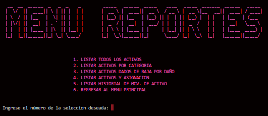

# SISTEMA G&C DE INVENTARIO CAMPUSLANDS
### ENQUE CONSISTE EL PROGRAMA

El programa permite llevar el control de todos los activos que se
encuentran en su sede principal ubicada en la ciudad de bucaramanga.

 

## TIPO DE IMPORTACIONES QUE SE HICIERON EN LA MAIN

## ALGUNOS DISEÑOS QUE SE HICIERON A LO LARGO DEL PROGRAMA

Utilice este tipo de funcion para asignar colores de cada a cada menu y un respectivo movimiento
cada color tiene una funcion en especifico:

 

- La función "animateTextDeLosMenusCyan" se utilizo solamente para el menu principal
- La función "animateTextDeLosMenusGreen" para mostrarme los tipos de errores
- La función "animateTextDeLosMenusMagenta" se utilizo para tabla de resultado
- La función "animateTextDeLosMenusRed" se utilizo para los menus segundarios
- La función "animateTextDeLosMenusYellow" se utilizo para elemento que proporcionan información al usuario para tener una mejor
al manejar el programa facilidad del programa

Este tipo de función solo se utilizo para limpiar la patalla en cualquier tipo de sistema operativo

## INTERFAS DEL PROGRAMA

Esta es la interfas del programa la cual se puede obsevar que tenemos diferentes opciones
cada una de estas opciones nos permite acceder a otro tipo de menus

 

### COMO ESTA CONSTRUIDO EL MENU

La varible opciones nos registra un codigo el cual va a ser evaluado por cada una de las condicones y me va a direccionar a los menus de dicha opcion y los except son posibles error que se registren en la varible opciones

 

## INTERFAS DE TODOS MENUS LOS MENUS

Como podemos notar en estas imagenes tiene la misma funcionalidad que la interfas
del programa, lo unico que tenemos que hacer es seleccionar una opcion

 

### COMO ESTA CONSTRUIDO LOS MENUS

### 

